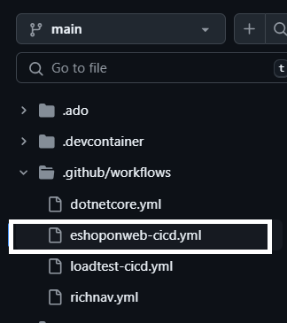

---
lab:
    title: 'Lab 02: Use GitHub Actions for Azure to publish a web app to Azure App Service'
    module: 'Module 2: Implement GitHub Actions for Azure'
---

# Overview

In this lab, you earn how to implement a GitHub Action workflow that deploys a web app to Azure App Service.

After you complete this lab, you will be able to:

* Implement a GitHub Action workflow for CI/CD.
* Explain the basic characteristics of GitHub Action workflows.

**Estimated completion time: 40 minutes**

## Prerequisites

* An **Azure account** with an active subscription. If you don't already have one, you can sign up for a free trial at [https://azure.com/free](https://azure.com/free).
    * An Azure web portal supported [browser](https://learn.microsoft.com/azure/azure-portal/azure-portal-supported-browsers-devices).
    * A Microsoft account or a Microsoft Entra account with the Contributor or the Owner role in the Azure subscription. For details, refer to [List Azure role assignments using the Azure portal](https://docs.microsoft.com/azure/role-based-access-control/role-assignments-list-portal) and [View and assign administrator roles in Azure Active Directory](https://docs.microsoft.com/azure/active-directory/roles/manage-roles-portal).
* A GitHub account. If you don't have a GitHub account that you can use for this lab, follow instructions available at [Signing up for a new GitHub account](https://github.com/join) to create one.

## Instructions

## Exercise 1: Import eShopOnWeb to your GitHub Repository

In this exercise, you will import the [eShopOnWeb](https://github.com/MicrosoftLearning/eShopOnWeb) repository to your GitHub account. The repository is organized the following way:

| Folder | Contents |
| -- | -- |
| **.ado** | Azure DevOps YAML pipelines |
| **.devcontainer** | Configuration to develop using containers (either locally in VS Code or GitHub Codespaces) |
| **infra** | Bicep and ARM infrastructure as code templates used in some lab scenarios |
| **.github** | YAML GitHub workflow definitions |
| **src** | The .NET 8 website used on the lab scenarios |

### Task 1: Import the eShopOnWeb repository

1. In your web browser navigate to GitHub [http://github.com](http://github.com) and sign in using your account.
1. Start the import process [https://github.com/new/import](https://github.com/new/import).
1. Enter the following information in the **Import your project to GitHub** page.

    | Setting | Action |
    |--|--|
    | **The URL for your source repository** | Enter `https://github.com/MicrosoftLearning/eShopOnWeb` |
    | **Owner** | Select your GitHub alias |
    | **Repository name** | Enter **eShopOnWeb** |
    | **Privacy** | After selecting the **Owner** the privacy options will appear. Select **Public**. |

1. Select **Begin import** and wait for the import process to complete.
1. On the repository page select **Settings**, then select  **Actions > General** in the left navigation pane.
1. In the **Actions permissions** section of the page select the **Allow all actions and reusable workflows** option, and then select **Save**.

> **NOTE:** The eShopOnWeb is a large repository and might take 5-10 minutes to finish importing.

## Exercise 2: Create Azure resources and configure GitHub 

In this exercise, you create an Azure Service Principal to authorize GitHub accessing your Azure subscription from GitHub Actions. You also review and modify the GitHub workflow that builds, tests, and deploys your website to Azure.

### Task 1: Create an Azure Service Principal and save it as GitHub secret

In this task, you will create a resource group and Azure Service Principal. The service principal is used by GitHub to deploy the desired eShopOnWeb app.

1. In your browser navigate to the Azure portal [https://portal.azure.com](https://portal.azure.com).
1. Open the **Cloud shell** and select the **Bash** mode. **Note:** You need to configure the persistent storage if this is the first time you launched the Cloud Shell.
1. Create a resource group with the following `az group create` CLI command. Replace `<location>` with a region near you.

    ```
    az group create -n az2006-rg -l <location>
    ```

1. Run the following command to register the resource provider for the **Azure App Service** you will deploy later in the lab.

    ```bash
    az provider register --namespace Microsoft.Web
    ```

1. Run the following command to generate a random name for the web app you deploy to Azure App Service. Copy and save the name the command outputs for use later in that lab.

    ```
    myAppName=az2006app$RANDOM
    echo $myAppName
    ```

1. Retrieve your Azure subscription ID with the `az account show` command. This command produces JSON output, please copy and save the GUID in the `"id": <GUID>` field. This is needed to create the service principal, and is also used later in the lab.

1. Create a service principal with the following commands. The first command stores the id of the resource group to a variable.

    ```
    rgId=$(az group show -n az2006-rg --query "id" -o tsv)

    az ad sp create-for-rbac --name GH-Action-eshoponweb --role contributor --scopes $rgId
    ```

    >**IMPORTANT:** This command outputs a JSON object that contains the identifiers used to authenticate against Azure in the name of a Microsoft Entra identity (service principal). Copy the JSON object for use in the following steps. 

1. In a browser window navigate to your **eShopOnWeb** GitHub repository.
1. On the repository page select **Settings**, then select **Secrets and variables > Actions** in the left navigation pane.
1. Select **New repository secret** and enter the following information:
    * **NAME**: `AZURE_CREDENTIALS`
    * **Secret**: Enter the JSON object generated when creating the service principal.
1. Select **Add secret**.

### Task 2: Modify and execute the GitHub workflow

In this task, you modify the provided *eshoponweb-cicd.yml* GitHub workflow and execute it to deploy the solution to your own subscription.

1. In a browser window, go back to your **eShopOnWeb** GitHub repository.
1. Select **<> Code** and, in the main branch, select the **eshoponweb-cicd.yml** in the **eShopOnWeb/.github/workflows** folder. This workflow defines the CI/CD process for the eShopOnWeb app.

    
1. Select **Edit this file**.
1. Change the fields in the `env:` section of the file to the following values.

    | Field | Action |
    |--|--|
    | RESOURCE-GROUP: | `az2006-rg` |
    | LOCATION: | `eastus` (Or, the region you selected when creating the resource group.) |
    | TEMPLATE-FILE: | No changes |
    | SUBSCRIPTION-ID: | Your subscription id. |
    | WEBAPP-NAME: | The randomly generated wep app name you created earlier in the lab. |

1. Read the workflow carefully, comments are provided to help you understand the steps in the workflow.
1. Uncomment the **on** section at the top of the file by deleting the `#`. The workflow triggers with every push to the main branch and also offers manual triggering (`workflow_dispatch`).
1. Select **Commit changes...** in the top right part of the page.
1. A pop-up windows will appear. Accept the defaults (committing directly to the main branch) and select **Commit changes**. The workflow will get automatically executed.

### Task 3: Review the GitHub Workflow execution

In this task, you will review the GitHub workflow execution and view the running application.

1.Select **Actions** and you will see the workflow setup before executing.

1. Select the **eShopOnWeb Build and Test** job in the **All workflows** section of the page. 

1. The workflow is composed of two operations: **buildandtest** and **deploy**. You can select either operation and view its progress, or wait until the job is completed.

1. Navigate to the Azure portal [https://portal.azure.com](https://portal.azure.com) and navigate to the **az2006-rg** resource group created before. Note that the GitHub Action, using a bicep template, has created an Azure App Service Plan + App Service in the resource group. 

1. Select the App Service resource (the unique app name generated earlier), and then select **Browse** near the top of the page to view the deployed web app.

## Exercise 3: Clean up resources

In this exercise you delete the resources created earlier in the lab.

1. Navigate to the Azure portal [https://portal.azure.com](https://portal.azure.com) and start the Cloud Shell. Select the **Bash** shell session.

1. Run the following command to delete the `az2006-rg` resource group. It will also remove the App Service Plan and App Service instance.

    ```
    az group delete -n az2006-rg --no-wait --yes
    ```

    >**Note**: The command executes asynchronously (set with the `--no-wait` parameter), so while you can run another Azure CLI command immediately afterwards within the same Bash session, it will take a few minutes before the resource groups are actually removed.

1. Delete the service principal by using the following commands. The first command saves the ID of the *GH-Action-eshoponweb* service principal and the second command deletes it.

    ```
    servicePrincipalID=$(az ad sp list --display-name GH-Action-eshoponweb --query "[].{spID:appId}" --output tsv)
    
    az ad sp delete --id $servicePrincipalID
    ```

## Review

In this lab, you implemented a GitHub Action workflow that deploys an Azure Web App.
