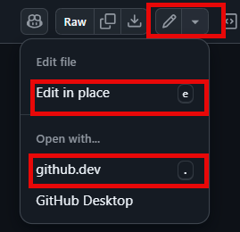

---
lab:
    title: 'Lab 03: Automate Azure Load Testing using GitHub Actions '
    module: 'Module 3: Implement Azure Load Testing'
---

# Overview

In this lab you learn how to configure GitHub Actions to deploy a sample web app and start a load test using Azure Load Testing.

In this lab you will:

* Create App Service and Load Testing resources in Azure.
* Create and configure a service principal to enable GitHub Actions workflows to perform actions in your Azure account.
* Deploy a .NET 8 application to Azure App Service using a GitHub Actions workflow.
* Update a GitHub Actions workflow to invoke a URL-based load test.

**Estimated completion time: 40 minutes**

## Prerequisites

* An **Azure account** with an active subscription. If you don't already have one, you can sign up for a free trial at [https://azure.com/free](https://azure.com/free).
    * An Azure web portal supported [browser](https://learn.microsoft.com/azure/azure-portal/azure-portal-supported-browsers-devices).
    * A Microsoft account or a Microsoft Entra account with the Contributor or the Owner role in the Azure subscription. For details, refer to [List Azure role assignments using the Azure portal](https://docs.microsoft.com/azure/role-based-access-control/role-assignments-list-portal) and [View and assign administrator roles in Azure Active Directory](https://docs.microsoft.com/azure/active-directory/roles/manage-roles-portal).
* A GitHub account. If you don't have a GitHub account that you can use for this lab, follow instructions available at [Signing up for a new GitHub account](https://github.com/join) to create one.


## Instructions

## Exercise 1: Import the sample app to your GitHub repositry

In this exercise, you will import the [Azure load test sample app](https://github.com/MicrosoftLearning/azure-load-test-sample-app) repository into your own GitHub account.

### Task 1: Import the eShopOnWeb repository

1. In your web browser navigate to GitHub [http://github.com](http://github.com) and sign in using your account.
1. Start the import process [https://github.com/new/import](https://github.com/new/import).
1. Enter the following information in the **Import your project to GitHub** page.

    | Setting | Action |
    |--|--|
    | **The URL for your source repository** | Enter `https://github.com/MicrosoftLearning/azure-load-test-sample-app` |
    | **Owner** | Select your GitHub alias |
    | **Repository name** | Name your repository |
    | **Privacy** | After selecting the **Owner** the privacy options will appear. Select **Public**. |

1. Select **Begin import** and wait for the import process to complete.
1. On the new repository page select **Settings**, then select  **Actions > General** in the left navigation pane.
1. In the **Actions permissions** section of the page select the **Allow all actions and reusable workflows** option, and then select **Save**.

## Exercise 2: Create resources in Azure

In this exercise you create the resources in Azure needed to deploy the app and run the test. 

### Task 1: Create resources using the Azure CLI

In this task you create the following Azure resources:

* Resource group
* App Service Plan
* App Service instance
* Load testing instance

1. In your browser navigate to the Azure portal [https://portal.azure.com](https://portal.azure.com).
1. Open the **Cloud shell** and select the **Bash** mode. **Note:** You might need to configure the persistent storage if this is the first time launching the Cloud Shell.

1. Run the following commands one at a time to create variables used in the commands in the rest of the steps. Replace `<mylocation>` with your preferred location.

    ```
    myLocation=<mylocation>
    myAppName=az2006app$RANDOM
    ```
1. Run the following command to create the resource group to contain the other resources.

    ```
    az group create -n az2006-rg -l $myLocation
    ```

1. Run the following command to register the resource provider for the **Azure App Service**.

    ```bash
    az provider register --namespace Microsoft.Web
    ```

1. Run the following command to create the App Service plan.

    ```
    az appservice plan create -g az2006-rg -n az2006webapp-plan --sku B1
    ```

1. Run the following command to create the App Service instance for the app.

    ```
    az webapp create -g az2006-rg -p az2006webapp-plan -n $myAppName --runtime "dotnet:8"
    ```

1. Run the following command to create a load test resource. If you get a prompt to install the **load** extension choose yes.

    ```
    az load create -n az2006loadtest -g az2006-rg --location $myLocation
    ```

1. Run the following commands to retrieve your subscription ID. **Note:** Be sure to copy and save the output from the commands, the subscription ID value is used later in this lab.

    ```
    subId=$(az account list --query "[?isDefault].id" --output tsv)
    
    echo $subId
    ```

### Task 2: Create the service principal and configure authorization

In this task you create a service principal for the app and configure it for OpenID Connect federated authentication.

1. In the Azure portal search for **Microsoft Entra ID** and navigate to the service.

1. In the left navigation pane select **App registrations** in the **Manage** group. 

1. Select **+ New registration** in the main panel and enter `GH-Action-webapp` as the name, and then select **Register**.

    >**IMPORTANT:** Copy and save both the **Application (client) ID** and **Directory (tenant) ID** values for later in this lab.


1. In the left navigation pane select **Certificates & secrets** in the **Manage** group, and then in the main window select **Federated credentials**. 

1. Select **Add a credential** and then select **GitHub Actions deploying Azure resources** in the selection drop down.

1. Enter the following information in the **Connect your GitHub account** section. **Note:** These fields are case sensitive. 

    | Field | Action |
    |--|--|
    | Organization | Enter your user or organization name. Example: `https://github.com/<user>/<repository>`.  |
    | Repository | Enter the name of the repository you created earlier in the lab. |
    | Entity type | Select **Branch**. |
    | GitHub branch name | Enter **main**. |

1. In the **Credential details** section give your credential a name and then select **Add**.

### Task 3: Assign roles the service principal

In this task you assign the necessary roles to the service principal to access your resources.

1. Run the following commands to assign the "Load Test Contributor" role so the GitHub workflow can send the resource tests to run. 

    ```
    spAppId=$(az ad sp list --display-name GH-Action-webapp --query "[].{spID:appId}" --output tsv)

    loadTestId=$(az resource show -g az2006-rg -n az2006loadtest --resource-type "Microsoft.LoadTestService/loadtests" --query "id" -o tsv)

    az role assignment create --assignee $spAppId --role "Load Test Contributor"  --scope $loadTestId
    ```

1. Run the following command to assign the "contributor" role so the GitHub workflow can deploy the app to App Service. 

    ```
    rgId=$(az group show -n az2006-rg --query "id" -o tsv)
    
    az role assignment create --assignee $spAppId --role contributor --scope $rgId
    ```

## Exercise 3: Deploy and test the web app using GitHub Actions

In this exercise you configure your repository to run the included workflows.

* The workflows are located in the *.github/workflows* folder of the repo.
* Both workflows, *deploy.yml* and *loadtest.yml* are configured to run manually.

During this exercise you edit repository files in the browser. After you select a file to edit, you can either:
* Select **Edit in place** and when your finished editing commit the changes. 
* Open the file with **github.dev** to edit with Visual Studio Code in the browser. If you choose this option you can return to the default repository experience by selecting **Return to repository** in the top menu.

    

### Task 1: Configure secrets

In this task you add secrets to your repo to enable the workflows to login to Azure on your behalf and perform actions.

1. In your web browser navigate to [GitHub](https://github.com) and select the repository you created for this lab. 
1. Select **Settings** at the top of the repo.
1. In the left navigation pane select **Secrets and variables**, and then select **Actions**.
1. In the **Repository secrets** section add the following three secrets. You add a secret by selecting **New repository secret**.

    | Name | Secret |
    |--|--|
    | AZURE_CLIENT_ID | Enter the **Application (client) ID** you saved earlier in the lab. |
    | AZURE_TENANT_ID | Enter the **Directory (tenant) ID** you saved earlier in the lab. |
    | AZURE_SUBSCRIPTION_ID | Enter the subscription id value you saved earlier in the lab. |

### Task 2: Deploy the web app

1. Select the *deploy.yml* file in the *.github/workflows* folder.

1. Edit the file and, in the **env:** section, change the value of the `AZURE_WEB_APP` variable. Replace `<your web app name>**` with the name of web app created earlier in this lab. Commit your change.

1. Take some time to review the contents of the workflow.

1. Select **Actions** in the top navigation of your repo. 

1. Select **Build and publish** in the left navigation pane.

1. Select the **Run workflow** drop down and select **Run workflow** keeping the default **Branch: main** setting. The workflow might take a little time to start.

If there are issues with the workflow completing successfully select the **Build and publish** workflow and then select **build** on the next screen. It will provide detailed information about the workflow and can help diagnose what issue prevented it from completing successfully.

### Task 3: Run a load test

1. Select the *loadtest.yml* file in the *.github/workflows* folder.

1. Edit the file and, in the **env:** section, change the value of the `AZURE_WEB_APP` variable. Replace `<your web app name>**` with the name of web app created earlier in this lab. Commit your change.

1. Take some time to review the contents of the workflow.

1. Select **Actions** in the top navigation of your repo. 

1. Select **Load test** in the left navigation pane.

1. Select the **Run workflow** drop down and select **Run workflow** keeping the default **Branch: main** setting. The workflow might take a little time to start.

    >**NOTE:** It may take 5-10 minutes for the workflow to complete. The test runs for two minutes, and it might take several minutes for the load test to queue and start in Azure. 

If there are issues with the workflow completing successfully select the **Build and publish** workflow and then select **build** on the next screen. It will provide detailed information about the workflow and can help diagnose what issue prevented it from completing successfully.

#### Optional

The *config.yaml* file in the root of the repository specifies the failure criteria for the load test. If you want to force the load test to fail perform the following steps.

1. Edit the *config.yaml* file located in the root of the repository.
1. Change the value in the `- p90(response_time_ms) > 4000` field to a low value. Changing it to `- p90(response_time_ms) > 50` will most likely cause the test to fail. That represents the app will respond within 50ms 90% of the time. 

### Task 4: View load test results

When you run a load test from your CI/CD pipeline, you can view the summary results directly in the CI/CD output log. Because the test results were saved as a pipeline artifact, you can also download a CSV file for further reporting.


## Exercise 4: Clean up resources

In this exercise you delete the resources created earlier in the lab.

1. Navigate to the Azure portal [https://portal.azure.com](https://portal.azure.com) and start the Cloud Shell. Select the **Bash** shell session.

1. Run the following command to delete the `az2006-rg` resource group. It will also remove the App Service Plan and App Service instance.

    ```
    az group delete -n az2006-rg --no-wait --yes
    ```

    >**Note**: The command executes asynchronously (set with the `--no-wait` parameter), so while you can run another Azure CLI command immediately afterwards within the same Bash session, it will take a few minutes before the resource groups are actually removed.

## Review

In this lab, you implemented GitHub Action workflows that deploys and load tests an Azure Web App.
