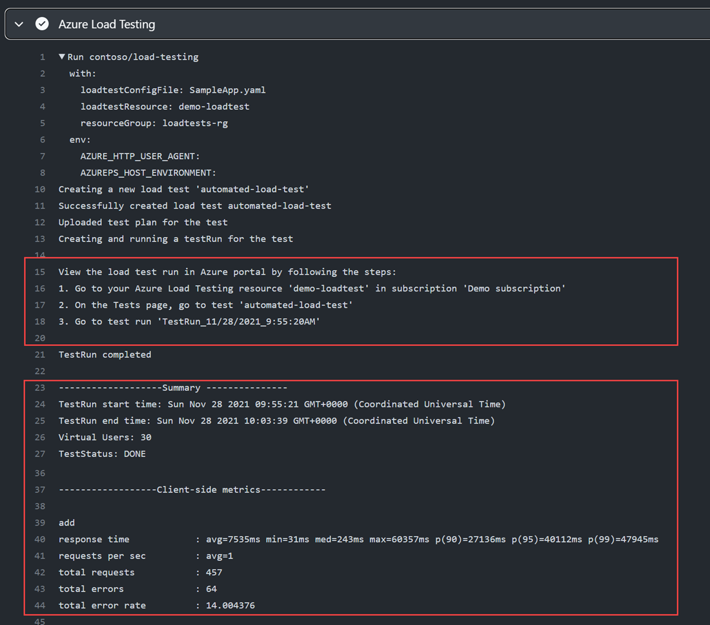

---
lab:
    title: 'Lab 03: Automate Azure Load Testing using GitHub Actions '
    module: 'Module 3: Implement Azure Load Testing'
---

# Overview

In this lab you learn how to configure GitHub Actions to deploy a sample web app and start a load test using Azure Load Testing.

In this lab you will:

* Create App Service and Load Testing resources in Azure.
* Create and configure a service principal to enable GitHub Actions workflows to perform actions in your Azure account.
* Deploy a .NET 8 application to Azure App Service using a GitHub Actions workflow.
* Update a GitHub Actions workflow to invoke a URL-based load test.

**Estimated completion time: 40 minutes**

## Prerequisites

* An **Azure account** with an active subscription. If you don't already have one, you can sign up for a free trial at [https://azure.com/free](https://azure.com/free).
    * An Azure web portal supported [browser](https://learn.microsoft.com/azure/azure-portal/azure-portal-supported-browsers-devices).
    * A Microsoft account or a Microsoft Entra account with the Contributor or the Owner role in the Azure subscription. For details, refer to [List Azure role assignments using the Azure portal](https://docs.microsoft.com/azure/role-based-access-control/role-assignments-list-portal) and [View and assign administrator roles in Azure Active Directory](https://docs.microsoft.com/azure/active-directory/roles/manage-roles-portal).
* A GitHub account. If you don't have a GitHub account that you can use for this lab, follow instructions available at [Signing up for a new GitHub account](https://github.com/join) to create one.


## Instructions

## Exercise 1: Import the sample app to your GitHub repositry

In this exercise, you will import the [Azure load test sample app](https://github.com/MicrosoftLearning/azure-load-test-sample-app) repository into your own GitHub account.

### Task 1: Import the eShopOnWeb repository

1. In your web browser navigate to GitHub [http://github.com](http://github.com) and sign in using your account.
1. Start the import process [https://github.com/new/import](https://github.com/new/import).
1. Enter the following information in the **Import your project to GitHub** page.

    | Setting | Action |
    |--|--|
    | **The URL for your source repository** | Enter `https://github.com/MicrosoftLearning/azure-load-test-sample-app` |
    | **Owner** | Select your GitHub alias |
    | **Repository name** | Enter **AzureLoadTest** |
    | **Privacy** | After selecting the **Owner** the privacy options will appear. Select **Public**. |

1. Select **Begin import** and wait for the import process to complete.
1. On the new repository page select **Settings**, then select  **Actions > General** in the left navigation pane.
1. In the **Actions permissions** section of the page select the **Allow all actions and reusable workflows** option, and then select **Save**.

## Exercise 2: Create resources in Azure

In this exercise you create the resources in Azure needed to deploy the app and run the test. 

### Task 1: Create resources using the Azure CLI

In this task you create the following Azure resources:

* Resource group
* App Service Plan
* App Service instance
* Load testing instance

1. In your browser navigate to the Azure portal [https://portal.azure.com](https://portal.azure.com).
1. Open the **Cloud shell** and select the **Bash** mode. **Note:** You might need to configure the persistent storage if this is the first time launching the Cloud Shell.

1. Run the following commands one at a time to create variables used in the commands in the rest of the steps. Replace `<mylocation>` with your preferred location.

    ```
    myLocation=<mylocation>
    myResourceGroup=az2006-rg
    myAppSvcPlan=az2006webapp-plan
    myAppName=az2006app$RANDOM
    myLoadTest=az2006loadtest
    ```
1. Run the following command to create the resource group to contain the other resources.

    ```
    az group create -n $myResourceGroup -l $myLocation
    ```

1. Run the following command to register the resource provider for the **Azure App Service**.

    ```bash
    az provider register --namespace Microsoft.Web
    ```

1. Run the following command to create the App Service plan.

    ```
    az appservice plan create -g $myResourceGroup -n $myAppSvcPlan --sku F1
    ```

1. Run the following command to create the App Service instance for the app.

    ```
    az webapp create -g $myResourceGroup -p $myAppSvcPlan -n $myAppName --runtime "dotnet:8"
    ```

1. Run the following command to create a load test resource. If you get a prompt to install the **load** extension choose yes.

    ```
    az load create --name $myLoadTest --resource-group $myResourceGroup --location $myLocation
    ```

### Task 2: Create and configure the service principal

In this task you create a service principal and configure it for OpenID Connect authorization. You also assign the necessary roles for the service principal to access your resources.

1. Run the following command to create a service principal.

    ```
    az ad sp create-for-rbac --name GH-Action-webapp
    ```

1. Run the following commands to assign the "Load Test Contributor" role so the GitHub workflow can send the resource tests to run. 

    ```
    spAppId=$(az ad sp list --display-name GH-Action-webapp --query "[].{spID:appId}" --output tsv)

    loadTestId=$(az resource show -g $myResourceGroup -n $myLoadTest --resource-type "Microsoft.LoadTestService/loadtests" --query "id" -o tsv)

    az role assignment create --assignee $spAppId --role "Load Test Contributor"  --scope $loadTestId
    ```

1. Run the following command to assign the "contributor" role so the GitHub workflow can deploy the app to App Service. 

    ```
    rgId=$(az group show -n $myResourceGroup --query "id" -o tsv)
    
    az role assignment create --assignee $spAppId --role contributor --scope $rgId
    ```

### Task 6: View load test results

When you run a load test from your CI/CD pipeline, you can view the summary results directly in the CI/CD output log. If you published the test results as a pipeline artifact, you can also download a CSV file for further reporting.



